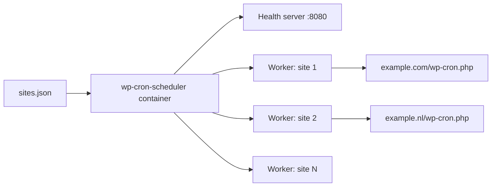

# wp-cron-scheduler

[](https://docs.docker.com/compose/)
[](https://www.python.org/)
[](LICENSE)

A lightweight Docker-based scheduler that spreads out WordPress cron (`wp-cron.php`) executions over time. Instead of a fixed crontab, a small Python service runs inside a container and triggers each site's cron on its own interval — with smart jitter to avoid thundering-herd bursts on your server.

Everything is configured with a single, human-editable JSON file. No database, no web UI, no extra services — just one container and one config file.

---

## Table of Contents

- [Features](#features)
- [How it works](#how-it-works)
- [Requirements](#requirements)
- [Quick start](#quick-start)
- [Configuration](#configuration)
- [Scheduling behavior](#scheduling-behavior)
- [Health check](#health-check)
- [Logs](#logs)
- [Run locally](#run-locally)
- [Project structure](#project-structure)
- [Contributing](#contributing)
- [License](#license)

---

## Features

- **Per-site intervals** — every WordPress site gets its own cron frequency.
- **Smart jitter** — each run is randomly offset within a bounded range, so scheduled hits are spread out and don't stack up.
- **Even initial spread** — start times are derived from a hash of the URL, so sites don't all fire at once when the container starts.
- **Zero-config deployment** — bring your own `sites.json`; the container does the rest.
- **Non-root container** — runs as an unprivileged user by default.
- **Built-in health check** — ready for Docker Compose `healthcheck`.

## How it works

The container runs one daemon thread per site. Each thread loops forever:

1. Call the site's cron URL over HTTP(S).
2. Log the result (`200` or error).
3. Sleep for `interval + jitter`.

A tiny HTTP health server on port `8080` serves `GET /health` → `200 OK`, which the Docker healthcheck uses to monitor the container.



## Requirements

- [Docker](https://www.docker.com/get-started) with [Docker Compose](https://docs.docker.com/compose/install/) (v2+).
- A reachable WordPress cron URL for each site.

> If you use WordPress with a host-based firewall or a bot-protection layer (e.g. Cloudflare), make sure the container can reach your site, or pass the cron request directly to PHP as described in the [WordPress docs](https://developer.wordpress.org/plugins/cron/).

## Quick start

1. Create a config file with your sites (see [Configuration](#configuration)):

   ```bash
   mkdir -p /opt/wp-cron-scheduler
   cp sites.example.json /opt/wp-cron-scheduler/sites.json
   # edit /opt/wp-cron-scheduler/sites.json with your own URLs and intervals
   ```

2. Start the scheduler:

   ```bash
   docker compose up -d --build
   ```

3. Verify it's running and healthy:

   ```bash
   docker compose ps
   docker compose logs -f
   ```

The container is configured to always restart (`restart: unless-stopped`), so it survives reboots and crashes.

## Configuration

All configuration lives in one JSON file, mounted read-only at `/config/sites.json` inside the container. A template is included at [`sites.example.json`](sites.example.json).

```json
[
  {
    "url": "https://www.example.com/wp-cron.php?doing_wp_cron",
    "interval": 900
  },
  {
    "url": "https://example.nl/wp-cron.php?doing_wp_cron",
    "interval": 300
  }
]
```

The file is a JSON **array of objects**. Each object has two required keys:

| Key        | Type    | Description                                        |
| ---------- | ------- | -------------------------------------------------- |
| `url`      | string  | The WordPress cron URL to call (must include `?doing_wp_cron` or be a direct `wp-cron.php` endpoint). |
| `interval` | integer | Seconds between cron runs for this site (e.g. `900` = every 15 minutes). |

Entries that are missing `url` or `interval` are skipped with a warning in the logs — they do not crash the container.

> **Note:** The config is mounted read-only on purpose. Edit the file on the host and restart the container (`docker compose restart`) to apply changes.

## Scheduling behavior

- **Start offset** — `int(md5(url).hexdigest(), 16) % interval`. Deriving the initial offset from a hash of the URL spreads start times evenly across sites.
- **Jitter** — for each run: `max_jitter = min(240, interval * 0.4)` and `sleep = max(1, interval + uniform(-max_jitter, max_jitter))`. The sleep is never negative, and jitter never exceeds 4 minutes or 40% of the interval.
- **Timeout** — each HTTP request has a 30-second timeout.

This keeps individual sites on schedule while preventing simultaneous bursts across all sites.

## Health check

The container exposes a minimal health endpoint:

```bash
curl http://localhost:8080/health
# -> 200 OK
```

The included `docker-compose.yaml` already wires this into Docker's `healthcheck` (checked every 150 s). You can see status with:

```bash
docker inspect --format '{{.State.Health.Status}}' wp-cron-scheduler
```

## Logs

```bash
docker compose logs -f
```

Log levels used by the scheduler:

| Level   | Meaning                                              |
| ------- | ---------------------------------------------------- |
| `INFO`  | Normal runs, per-request status codes, worker startup. |
| `WARNING` | A site returned a non-`200` status.                 |
| `ERROR` | A request raised an exception.                       |
| `DEBUG` | Timing details of the next scheduled run.            |

Logging is bounded via Docker's `json-file` driver (10 MB per file, 3 files).

## Run locally

To run the scheduler without Docker, you need a config file at the hardcoded path `/config/sites.json`:

```bash
mkdir -p /config
cp sites.example.json /config/sites.json
python3 -m pip install -r requirements.txt
python3 cron_scheduler.py
```

> `CONFIG_PATH` is currently hardcoded to `/config/sites.json`; there is no CLI flag to override it yet.

Validate a config file quickly:

```bash
python3 -c "import json; json.load(open('sites.json'))"
```

## Project structure

```
.
├── cron_scheduler.py      # The entire scheduler (health server + workers + config loader)
├── docker-compose.yaml    # Compose definition incl. healthcheck and read-only config mount
├── Dockerfile             # python:3-slim image, non-root user, curl for healthcheck
├── requirements.txt       # Python dependencies (only requests)
├── sites.example.json     # Config template
└── README.md
```

## Contributing

Contributions are welcome! Please:

1. Fork the repository.
2. Create a feature branch.
3. Open a pull request with a clear description of the change.

Keep code comments and log messages in English so the whole world can maintain it.

## License

This project is licensed under the [MIT License](LICENSE).
